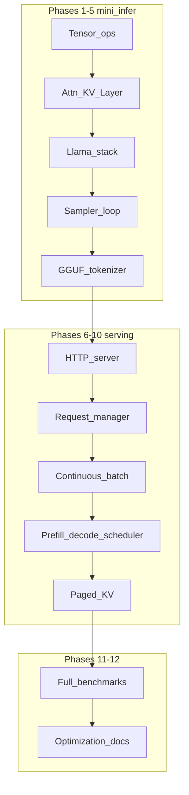

# C++ LLM Serving Layer — Implementation Plan

## How this maps to `plan.txt`

The table in [plan.txt](plan.txt) lists 12 focus areas; rows **1 and 2 are reversed for implementation** (transformer before tensor is not runnable). This document keeps **all 12 topics** and the **mini_infer → load → HTTP serving → request management** story from the bottom of [plan.txt](plan.txt), reordered so each phase **depends only on prior phases** and **ships visible output** (CLI, server, or report).

| New phase | Original `plan.txt` row | Runnable output after phase |
|-----------|-------------------------|-----------------------------|
| 1 | 2 — Tensor + basic operators | `bench_ops`, micro GTests pass |
| 2 | 1 — Transformer + attention + KV | `bench_attention`, one-layer forward |
| 3 | 3 — Llama-style forward | `bench_forward`, multi-layer random weights |
| 4 | 4 — Token generation + sampling | **`mini_infer` CLI** (synthetic weights): greedy decode |
| 5 | 5 — Model loading + tokenizer | **`mini_infer` on real GGUF**; logits parity vs llama.cpp |
| 6 | 6 — HTTP inference server | `curl /generate` single-thread |
| 7 | 7 — Request manager + worker | concurrent clients → queue → worker |
| 8 | 8 — Continuous batching | higher throughput multi-request |
| 9 | 9 — Prefill/decode scheduling | scheduler matches [target_architechture.txt](target_architechture.txt) |
| 10 | 10 — Paged KV cache | long-context without huge contiguous alloc |
| 11 | 11 — Benchmarking + profiling | published baseline table vs llama.cpp |
| 12 | 12 — Optimization + docs | SIMD/quant paths + architecture doc |



---

## Repo layout (created in Phase 1)

```
serving_layer/
  CMakeLists.txt
  docks/plan.md              # canonical phase list (this plan)
  cmake/                     # FetchContent: GTest, benchmark, Boost
  src/
    core/                    # tensor, memory, dtypes
    ops/                     # matmul, rmsnorm, rope, softmax, silu, ...
    model/llama/             # config, blocks, forward
    cache/                   # kv_cache → paged (phase 10)
    sampler/
    io/                      # gguf, tokenizer (phase 5)
    server/                  # http, request, scheduler (phases 6-9)
  tests/                     # gtest targets per module + integration
  benchmarks/                # google benchmark + llama.cpp driver scripts
  tools/
    mini_infer/              # CLI entry (phases 4+)
  scripts/
    compare_llama_cpp.py     # logits/token diff vs llama-cli
```

**Tooling:** C++17+, CMake 3.20+, **GoogleTest**, **Google Benchmark**, **Boost.Asio + Boost.Beast** (per serving-layer notes in [plan.txt](plan.txt)). CPU-first; optional OpenMP for matmul later (phase 12).

**Benchmark reference:** **Llama-3.2-1B Instruct (or base) Q4_K_M GGUF** — same file for your engine and `llama-cli` (`-ngl 0` for fair CPU comparison early on).

**Per-phase gate (every phase):**

1. `ctest` — unit + integration tests for that phase's scope
2. `benchmarks/*` — at least one registered benchmark with documented command
3. **Correctness artifact** — for phases 5+: max logit diff / token match vs llama.cpp on a fixed prompt list stored in `tests/fixtures/prompts.txt`

---

## Phase 1 — Tensor + basic operators (orig. row 2)

**Implementation guide:** [phase1-implementation.md](phase1-implementation.md) · **Coding style:** [cpp-coding-style.md](cpp-coding-style.md)

**Goal:** Numeric foundation everything else uses.

**Implement:**

- `Tensor`: shape, strides, `float` / `float16` storage (start `float`; add `f16` when GGUF dequant needs it)
- Views, contiguous checks, simple CPU allocators
- Ops: `matmul`, elementwise add/mul, **RMSNorm**, **softmax** (stable), **SiLU**, embedding lookup

**Deliverables:** library `serving_core`; binary `bench_ops`.

**GTests:** small fixed tensors (hand-computed or JSON goldens); RMSNorm/softmax edge cases (single row, large dim).

**Benchmarks:** matmul `(M,K) x (K,N)` sweeps; RMSNorm over `hidden_size` typical of 1B (e.g. 2048).

---

## Phase 2 — Transformer block + attention + KV cache (orig. row 1)

**Goal:** One correct **Llama-shaped block** (pre-norm, residual, GQA attention, SwiGLU FFN) with **KV cache** for decode.

**Implement:**

- **RoPE** (freqs from head_dim / config)
- **GQA:** Q/K/V projections, repeat K/V heads, scaled dot-product, causal mask
- **KVCache:** append step for `(batch, seq, kv_heads, head_dim)`; read full history for attention
- `TransformerBlock`: attn → residual → FFN (gate/up/down) → residual

**Deliverables:** `bench_attention`; test harness `tests/test_one_block_forward.cpp`.

**GTests:** attention scores vs naive reference on `seq=4, heads=2`; KV cache: two forward steps equal one joint prefill for same tokens.

**Benchmarks:** single-layer prefill tokens/s for seq 128/512 (random weights).

---

## Phase 3 — Llama-style full model forward (orig. row 3)

**Goal:** Stack `n_layer` blocks + token embedding + output norm + **lm_head** logits.

**Implement:**

- `LlamaConfig` (dim, n_heads, n_kv_heads, n_layer, vocab, rope_theta, …)
- `LlamaModel::forward(input_ids, positions, use_cache)` → logits `(batch, seq, vocab)` or last token only for decode
- Tie or untie embeddings per GGUF metadata (phase 5)

**Deliverables:** `bench_forward`; `mini_infer` stub that runs **one forward** on random weights.

**GTests:** output shapes; deterministic forward with fixed seed weights; optional compare to exported PyTorch trace for **tiny** random model (8 dim, 2 layers) if you add a one-time export script.

**Benchmarks:** full-model forward latency (random 1B-shaped config, f32 weights) for seq 1 and 128.

---

## Phase 4 — Token generation + sampling (orig. row 4)

**Goal:** Close the **mini_infer** loop from [plan.txt](plan.txt) (sampler branch) using **synthetic** weights from phase 3.

**Implement:**

- `Sampler`: greedy, temperature, top-k, top-p; seeded RNG for tests
- `GenerationLoop`: prefill prompt ids → decode loop with KV cache; stop at EOS / `max_tokens`

**Deliverables:** **`tools/mini_infer`** CLI:

```text
mini_infer --model synthetic --prompt "Hello" --max-tokens 16 --greedy
```

**GTests:** sampler distributions with fixed seed; full loop token ids for tiny model.

**Benchmarks:** decode tokens/s (synthetic 1B shape, seq_out=64).

---

## Phase 5 — Model loading + tokenizer (orig. row 5) — **Llama GGUF milestone**

**Goal:** Real **Llama-3.2-1B Q4_K_M** inference; this completes **mini_infer** with loader + tokenizer leaves.

**Implement:**

- **GGUF** reader: tensor names, shapes, quant types (start: dequant Q4_K → f32 for correctness; fast path in phase 12)
- Map tensors to `LlamaModel` (llama.cpp naming conventions as reference)
- **Tokenizer:** BPE from GGUF vocab; special tokens

**Deliverables:**

```text
mini_infer --model path/to/llama-3.2-1b.Q4_K_M.gguf --prompt "..." --max-tokens 32
```

**GTests:** load succeeds; tokenize known strings; **logits** at last prefill position vs llama.cpp within tolerance (e.g. max abs diff threshold documented per quant).

**Benchmarks:** weight load time; prefill+decode tok/s vs `llama-cli` same flags (script records both).

---

## Phase 6 — C++ HTTP inference server (orig. row 6)

**Goal:** [target_architechture.txt](target_architechture.txt) API front door.

**Implement:**

- Boost.Beast HTTP/1.1: `GET /health`, `POST /generate` JSON `{prompt, max_tokens, temperature}`
- **Single worker, blocking** — one request at a time (correctness first)

**Deliverables:** `serving_server` binary; example curl in `docks/api.md`.

**GTests:** spawn server on ephemeral port; POST and assert JSON schema + non-empty text.

**Benchmarks:** latency p50 for short prompt (1 client); not throughput yet.

---

## Phase 7 — Request manager + worker model (orig. row 7)

**Goal:** States from [plan.txt](plan.txt): **QUEUED → PREFILL → DECODING → FINISHED**; per-request fields (id, tokens, max_tokens, temperature, KV slot).

**Implement:**

- Thread-safe queue; worker thread(s) owning model + **per-request KVCache handle**
- Model mutex or single GPU-style “one engine” — document threading model

**Deliverables:** server accepts overlapping requests; responses complete in order or by finish time (document policy).

**GTests:** state machine transitions; two sequential requests don't corrupt KV.

**Benchmarks:** 10 sequential vs 10 queued requests (latency under load).

---

## Phase 8 — Continuous batching (orig. row 8)

**Goal:** Batch prefill and decode steps where safe (same phase of generation).

**Implement:**

- Pad/bucket sequences; batched matmul/attention (start with simple loop-over-batch if needed, then fused)
- Dynamic batch formation from queue

**GTests:** batched vs serial token streams match for 2–3 prompts.

**Benchmarks:** total tok/s vs phase 7 with N concurrent requests.

---

## Phase 9 — Prefill/decode scheduling (orig. row 9)

**Goal:** Split **Prefill Engine** vs **Decode Engine** scheduling per architecture diagram.

**Implement:**

- Scheduler policy: e.g. prioritize decode steps, chunk large prefills (simple round-robin first)
- Metrics hooks (queue depth, batch size)

**GTests:** deterministic schedule traces on fixed request timeline.

**Benchmarks:** mixed workload (long prefill + many decode clients) vs phase 8.

---

## Phase 10 — Paged KV cache (orig. row 10)

**Goal:** Block/page allocator; KV not one giant `(max_seq * batch)` buffer.

**Implement:**

- Fixed **block size** (e.g. 16 tokens); free list; map logical seq → physical blocks
- Attention reads through block table (llama.cpp / vLLM style, simplified)

**GTests:** paged vs contiguous cache identical tokens; allocation failure when pool exhausted.

**Benchmarks:** memory high-water for 8 concurrent 2k-context requests; tok/s vs phase 9.

---

## Phase 11 — Benchmarking + profiling (orig. row 11)

**Goal:** Consolidate **production-style** numbers (not only phase-local microbenches).

**Implement:**

- Suite: **TTFT**, prefill tok/s, decode tok/s, peak RSS; vs **llama.cpp** on same GGUF and CPU threads
- Optional: Tracy or `perf` notes in `docks/benchmarks.md`
- CI-friendly “smoke” bench (tiny model) + manual full bench doc

**Deliverables:** `docks/benchmarks.md` table (your engine vs llama.cpp); reproducible `scripts/run_all_benchmarks.sh`.

**GTests:** regression guard — logits parity smoke test on 1 prompt.

---

## Phase 12 — Optimization + architecture documentation (orig. row 12)

**Goal:** Close the loop on performance and docs.

**Implement (prioritized):**

- Matmul: blocked + SIMD (AVX2) or delegate to one external BLAS if you choose
- Keep Q4_K matmul without full dequant (if not done earlier)
- Thread count / affinity tuning

**Deliverables:** updated [target_architechture.txt](target_architechture.txt) → `docks/architecture.md` with data-flow diagram; optimization changelog.

**GTests:** no regressions on parity tests; SIMD path bit-exact or within fp tolerance.

**Benchmarks:** before/after table appended to `docks/benchmarks.md`.

---

## llama.cpp comparison workflow (phases 5+)

1. Pin GGUF path via env `SERVING_GGUF_PATH` or test skip if unset.
2. `llama-cli -m same.gguf -p "..." -n 0 --logits` (or export hidden) for logit check; generation compare with `--temp 0` greedy.
3. Python helper `scripts/compare_llama_cpp.py` parses both outputs → CI threshold.

---

## Risk notes (scope control)

- **GGUF quant kernels** are large; plan explicitly defers **fast Q4 matmul** to phase 12 unless decode is too slow — correctness first with dequant.
- **CUDA** is out of scope unless you add a later phase; matches CPU comparison to `llama-cli -ngl 0`.
- First server is **HTTP only** (no OpenAI-compatible streaming until after phase 6 stabilizes; optional follow-up).

---

## Next steps when you start coding

1. Scaffold CMake + GTest + Benchmark + empty `src/core`.
2. Implement Phase 1 ops and land first `ctest` + `bench_ops` green.
3. Repeat per-phase gates above before moving to the next phase.
